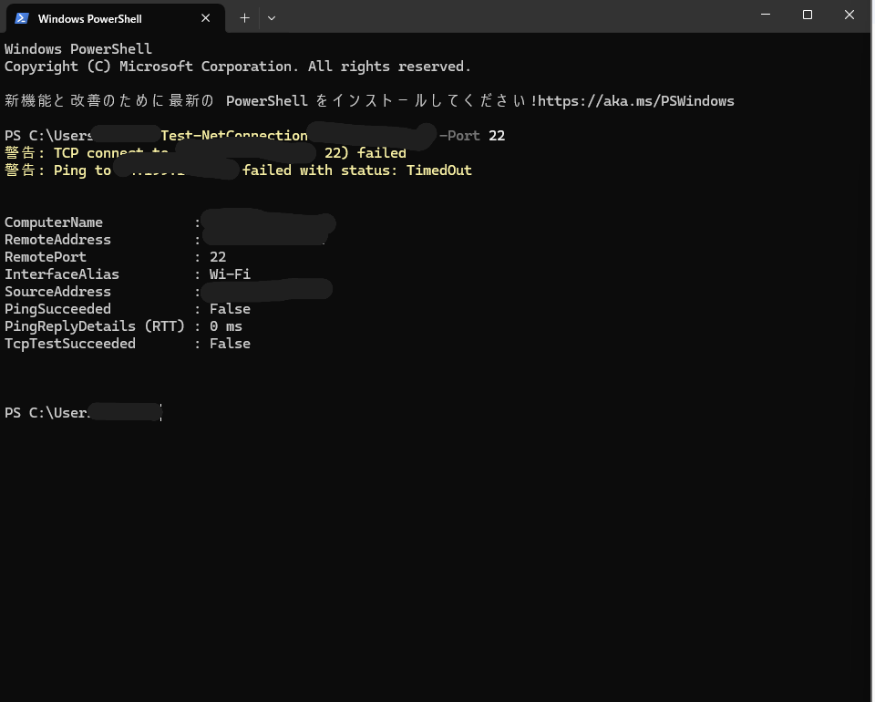
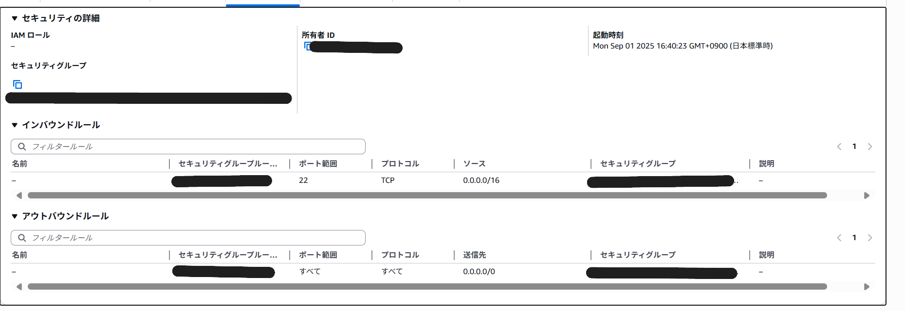
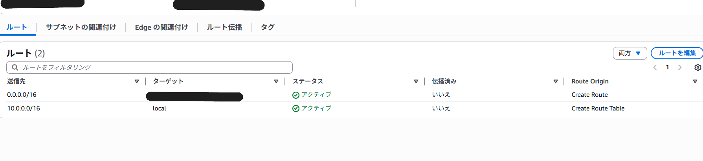
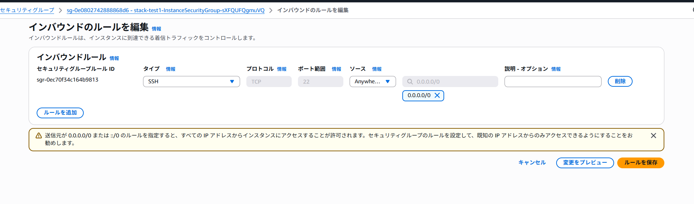
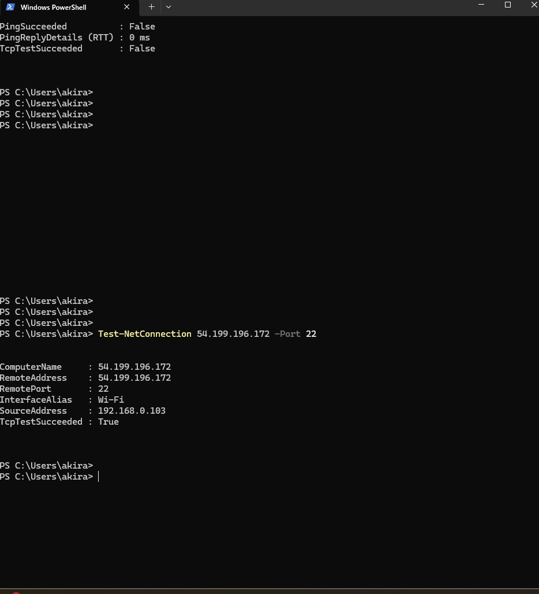
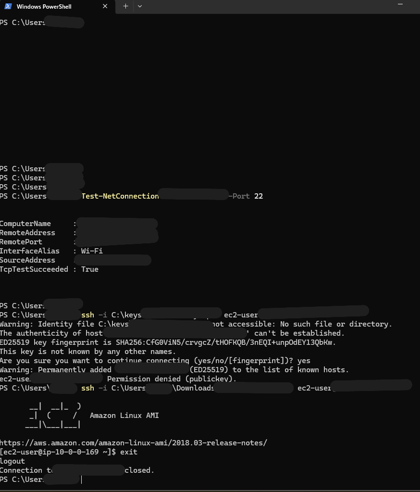

# Troubleshooting SSH Connection to AWS EC2  
_AWS実戦課題1: EC2に接続できない問題を解決_

GitHub Repository: https://github.com/<username>/aws-ec2-ssh-troubleshooting  

---

## 🔧 Skills & Tools / 使用技術

AWS EC2 / VPC / Security Groups / Route Tables / CloudFormation / PowerShell / SSH  

---

## 1. Overview / 概要

* **English:**  
  This project documents the troubleshooting process for resolving SSH connection failures to an EC2 instance in AWS. It was based on a hands-on training exercise (CloudTech).  

* **日本語:**  
  本プロジェクトは、AWSのEC2インスタンスにSSH接続できない問題を解決するまでのトラブルシューティングの記録です。クラウドテックの実戦課題を参考にしました。  

---

## 2. Problem Statement / 課題

* **English:**  
  After deploying an EC2 instance using a CloudFormation template, I was unable to establish an SSH connection. Initial attempts with PowerShell showed a timeout on port 22.  

* **日本語:**  
  CloudFormationテンプレートでEC2インスタンスをデプロイ後、SSH接続ができませんでした。PowerShellでの初期テストでは、ポート22がタイムアウトする状態でした。  

📸 Screenshot:  
  

---

## 3. Investigation & Findings / 調査と発見

* **English:**  
  - **Security Group Misconfiguration:** SSH inbound rule was restricted (`0.0.0.0/16` instead of `0.0.0.0/0`).  
  - **Route Table Issue:** The route table lacked a valid route to the Internet Gateway.  
  - **Key Pair Path:** Local `.pem` file path was incorrect at first attempt.  

* **日本語:**  
  - **セキュリティグループの設定ミス:** インバウンドルールが `0.0.0.0/16` になっており、全世界からのアクセスを受け付けていませんでした。  
  - **ルートテーブルの問題:** インターネットゲートウェイへのルートが不足していました。  
  - **キーペアのパス誤り:** ローカルの `.pem` ファイルのパス指定を誤っていました。  

📸 Screenshots:  
  
  

---

## 4. Solution / 解決方法

* **English:**  
  - Updated the Security Group rule to `0.0.0.0/0` for port 22 (for testing purposes).  
  - Corrected the Route Table to include a route to the Internet Gateway.  
  - Fixed the key file path and connected successfully via PowerShell SSH.  

* **日本語:**  
  - セキュリティグループのインバウンドルールを `0.0.0.0/0` に修正（学習環境のため一時的に設定）。  
  - ルートテーブルを修正し、インターネットゲートウェイへのルートを追加。  
  - `.pem` ファイルのパスを修正し、PowerShellからSSH接続に成功しました。  

📸 Screenshots:  
  

---

## 5. Before → After Comparison / 修正前後の比較

| 状態 | 問題点 | 修正内容 |
|------|--------|----------|
| **Before** | SG inbound rule = `0.0.0.0/16` | Changed to `0.0.0.0/0` |
| **Before** | No IGW route in Route Table | Added IGW route |
| **Before** | Wrong `.pem` path | Correct path specified |

---

## 6. Verification / 検証結果

* **English:**  
  After applying the fixes, `Test-NetConnection` succeeded on port 22. SSH login was then successful using the correct `.pem` key.  

* **日本語:**  
  修正後、`Test-NetConnection` でポート22への疎通確認に成功。その後、正しい `.pem` ファイルを指定してSSH接続に成功しました。  

📸 Screenshots:  
  
  

---

## 7. Lessons Learned / 学び

* **English:**  
  - Security Group misconfiguration → Learned the importance of defining correct CIDR ranges.  
  - Missing route to Internet Gateway → Understood routing’s critical role in connectivity.  
  - Wrong key file path → Realized the need for careful local environment management.  

* **日本語:**  
  - セキュリティグループの設定ミス → CIDR範囲を正しく指定する重要性を学んだ。  
  - ルートテーブルにIGWルート不足 → ネットワーク接続性におけるルーティングの重要性を理解した。  
  - 鍵ファイルのパス誤り → ローカル環境の管理を徹底する必要性を実感した。  

---

## 8. Repository Structure / リポジトリ構成

aws-ec2-ssh-troubleshooting/
├── README.md
└── images/
├── connection-failed.png
├── connection-success.png
├── sg-wrong.png
├── sg-fixed.png
├── route-table-before.png
├── route-table-fixed.png

└── ssh-success.png
